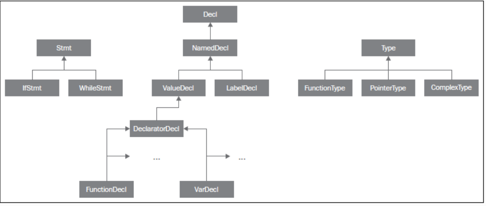
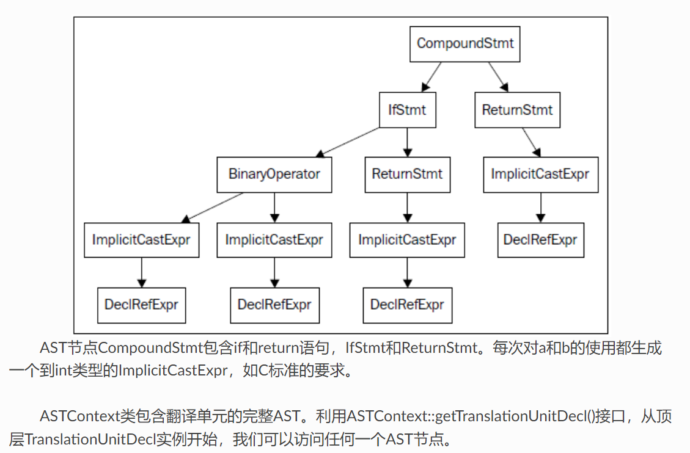

# 反射的实现

[參考1](https://feiqi3.cn/blog/124) ， [參考2](https://cloud.tencent.com/developer/article/2168328), [参考3](https://github.com/huangfeidian/meta)
[参考4](https://getting-started-with-llvm-core-libraries-zh-cn.readthedocs.io/zh-cn/latest/ch04.html)

1. 最终期望使用上接近rttr 这个库， 同时不需要侵入注册代码， 不需要手动注册，也就是不需要我们自己去写下面这一坨

```c++
//register code
//-------------------------------------
__register_type<Vector3>("Vector3")
        .constructor()
        .constructor<double, double, double>()
        .property("x", &Vector3::x)
        .property("y", &Vector3::y)
        .property("z", &Vector3::z)
        .function("DotProduct", &Vector3::DotProduct);
        );

```

2. Clang AST 节点树

一个AST节点表示声明、语句、类型。因此，有三个表示AST的核心类：Decl、Stmt、Type。在Clang中，每个C或C++语言结构都表示为一个C++类，它们必须继承上述核心类之一。下图说明了其部分类层级。例如，IfStmt类（表示一个完整的if语句体）直接继承Stmt类。另一方面，FunctionDecl和VarDecl——用以存放函数和变量的声明或定义—继承多个类，并且只是间接继承Decl。






## Cursors

Pointers to the AST are called Cursors in libclang lingo. A Cursor can have a parent and children. It can also have related cursors (like a default value for a parameter, an explicit value to an enum entry, etc).

The ‘entry point’ cursor we will use is the cursor representing the Translation Unit (TU), which is a C++ term meaning a single file including all #included code. To get the TU’s cursor we will use the very descriptive clang_getTranslationUnitCursor(). Now that we have a cursor we can investigate it or iterate using it.

## Visit Children

Any cursor has a kind, which represents the essence of the cursor. Kind can be one of many, many options, as can be seen here. A few examples are:

```c++
  /** \brief A C or C++ struct. */
  CXCursor_StructDecl                    = 2,
  /** \brief A C or C++ union. */
  CXCursor_UnionDecl                     = 3,
  /** \brief A C++ class. */
  CXCursor_ClassDecl                     = 4,
  /** \brief An enumeration. */
  CXCursor_EnumDecl                      = 5,


  CXCursor cursor = clang_getTranslationUnitCursor(unit);
  clang_visitChildren(
        
    cursor,
    [](CXCursor c, CXCursor parent, CXClientData client_data)
    {
      cout << "Cursor kind: " << clang_getCursorKind(c) << endl;
      return CXChildVisit_Recurse;
    },
    nullptr);

```

